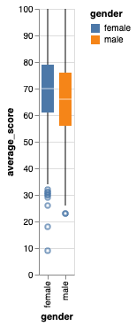
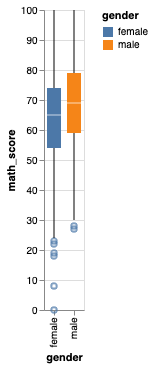
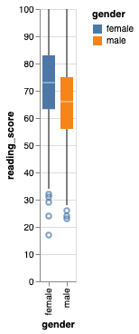
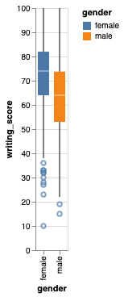
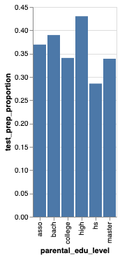

# Prove 13: Student Performance
**Abigail Priebe**

### Background
For this project, I decided to do a data analysis on a dataset I found on [Kaggle.com](https://www.kaggle.com/spscientist/students-performance-in-exams) to better understand what factors play into a students test performance. The dataset provides information such as gender, race/ethnicity, their parent's level of education, and how they scored in different academic areas. 

### Graphical Summaries
In order to better understand and analyze the questions I hoped to answer through this analysis, I made the following plots 

**Question 1 Box Plots**
   

**Question 2 Scatter Plot**

**Question 3 Bar Plot**
